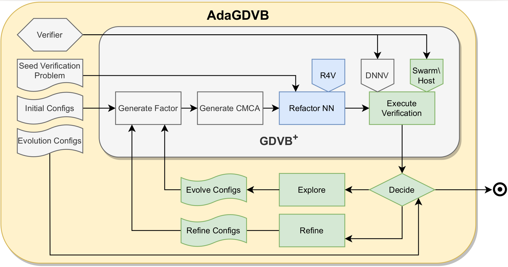
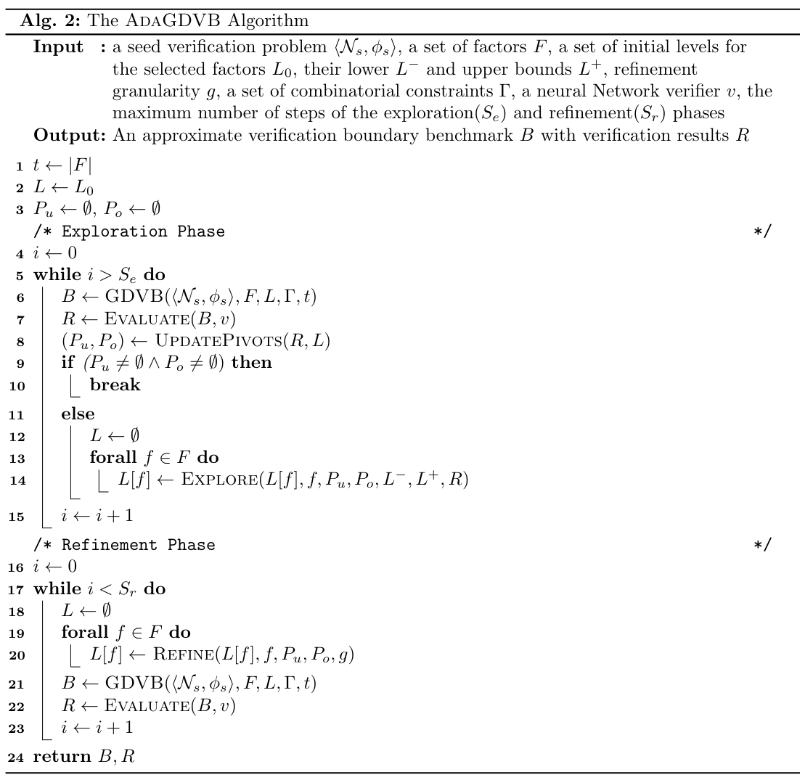

# [The **AdaGDVB** Framework] Adaptive Benchmark Generation for DNN Verification


## I. Overview
The AdaGDVB framework, which was developed for the paper titled "[Adaptive Benchmark Generation for DNN Verification](link_not_avaliable_yet)," serves as a means to showcase the functionality of the proposed methods outlined in the paper and to reproduce the evaluation results presented within. This artifact encompasses several components, including 1) guidelines for installing the AdaGDVB framework and its dependencies, 2) a tutorial of applying AdaGDVB on the abcrown verifier over the MNIST_3x1024 architecture 3) detailed information about the configurable parameters, and 4) instructions and scripts to fully replicate the research results. 5) an overview of extending AdaGDVB with new architecture and new verifiers. It is important to note that the AdaGDVB tool is implemented in the Python programming language, thus users are expected to possess a certain level of familiarity with Python, as well as neural network training and verification techniques.

AdaGDVB is an extension of [GDVB](https://link.springer.com/chapter/10.1007/978-3-030-53288-8_5), which enables the iterative creation of various DNN verification benchmarks to determine the boundaries of verification performance for DNN verifiers. The tool is compatible with Fully Connected and Convolutional neural network structures, and it includes two pre-defined networks: [MNIST_3x1024](configs/M3x1024.onnx) and [CIFAR_convbig](configs/CCB.onnx). The evaluation of verification performance primarily focuses on assessing the verifiers' capabilities in handling local robustness properties.



The **AdaGDVB** overview diagram showcases the upgraded version of GDVB(**$GDVB^+$**) along with the newly introduced features in AdaGDVB. The blue procedures are the enhanced features, and the green procedures are the new features, compared to the original GDVB framework.

The **$GDVB^+$** framework encompasses the following components: 1) factor generation, 2) CMCA(Constrained Mixed Covering Array) generation, 3) neural networks refactorization using the [R4V](https://github.com/edwardxu0/r4v) Tool, and verification execution frameworks, such as [DNNV](https://github.com/dlshriver/dnnv) and [SwarmHost](https://github.com/edwardxu0/SwarmHost). The primary objective of GDVB is to produce a singular verification benchmark and execute the designated verifier. Initially, GDVB generates a set of factors based on the *initial configs*, followed by generating the covering array based on these factors. Subsequently, R4V is utilized to create the neural networks within the benchmark. Additionally, there is a pipeline for executing verifiers and parsing the results through frameworks like DNNV and SwarmHost. For further information, please consult the original [paper](https://link.springer.com/chapter/10.1007/978-3-030-53288-8_5)  on GDVB.

The **AdaGDVB** framework extends the **$GDVB^+$**  to achieve the objective of finding Verification Performance Boundaries(**VPB**). The process of the VPB search lies in two phases, namely **Exploration** and **Refinement**. During the Exploration phase, the *Explore* procedure iteratively adjusts the GDVB benchmark to find the VPB. In the Refinement phase, the *Refine* procedure iteratively enhances the VPB with finer granularity to provide a clearer understanding. The *Decide* procedure determines when to transition from the **Exploration** phase to the **Refinement** and when to conclude the search. For further information on the AdaGDVB algorithm, please consult section VII and refer to the associated paper.


## II. Installation
1. Acquire the [Conda](https://docs.conda.io/projects/conda/en/stable/user-guide/install/index.html) environment management tool. Install and activate the `adagdvb` conda environment.
   ```shell
   conda env create --name adagdvb -f .env.d/env.yml
   . .env.d/openenv.sh
   ```
2. Acquire [GDVB](https://github.com/edwardxu0/GDVB) and follow its instructions to install the all its dependency. The frameworks includes GDVB, [R4V](https://github.com/edwardxu0/R4V), a verification framework, such as [SwarmHost](https://github.com/edwardxu0/SwarmHost) or [DNNV](https://github.com/dlshriver/dnnv), and a verifier of the chosen verification framework. For instance, the following commands install the GDVB, R4V, the SwarmHost Verification framework, and the abcrown verifier inside SwarmHost. For more information, please consult their installation guides.
    ```shell
    # 1) install GDVB
    git clone git@github.com:edwardxu0/GDVB.git $AdaGDVB/lib/GDVB
    conda env create --name gdvb -f $GDVB/.env.d/env.yml
    
    # 2) install R4V
    git clone https://github.com/edwardxu0/R4V.git $GDVB/lib/R4V
    conda env create --name r4v -f $R4V/.env.d/env.yml
    
    # 3) install verification framework, e.g., SwarmHost
    git clone https://github.com/edwardxu0/SwarmHost.git $GDVB/lib/SwarmHost
    wget https://raw.githubusercontent.com/dlshriver/dnnv/main/tools/resmonitor.py $SwarmHost/lib
    conda env create --name swarmhost -f $SwarmHost/.env.d/env.yml
    
    # 4) install a verifier in the verification framework, e.g., abcrown of SwarmHost
    git clone --recursive https://github.com/Verified-Intelligence/alpha-beta-CROWN.git $SwarmHost/lib/abcrown
    conda env create --name abcrown -f $SwarmHost/envs/abcrown.yml
    ```
3. Use `conda env list` to check if the conda environments are installed. Here is an example:
    ```shell
    # conda environments:
    #
    base                     /home/user/miniconda3
    abcrown                  /home/user/miniconda3/envs/abcrown
    adagdvb                  /home/user/miniconda3/envs/adagdvb
    gdvb                     /home/user/miniconda3/envs/gdvb
    r4v                      /home/user/miniconda3/envs/r4v
    ```

## III. Tutorial on AdaGDVB
In this section, we employ AdaGDVB on the toy "MNIST_tiny" seed verification problem to produce a small DNN verification benchmark and execute the verification process within the SwarmHost framework using the abcrown verifier. Subsequently, we analyze verification results with the SCR and PAR2 metrics.

The "MNIST_tiny" seed verification problem includes a small neural network and a local robustness property. The neural network has 3 hidden layers with 50 neurons in each. The local robustness property is defined on epsilon of 0.02. The configuration file is stored as `configs/mnist_tiny.toml`. It defines two factors, the number of neurons and number of FC layers, where each has three evenly distributed levels, e.g., 1/3, 2/3, and 1 scaling ratio compared to the seed network.

1. The AdaGDVB framework employs a command-line interface for its operations. To ensure the correct installation of AdaGDVB, one should load the conda environment and consult the help manual.
```
. .env.d/openenv.sh
adagdvb -h
    ___       __      __________ _    ______ 
   /   | ____/ /___ _/ ____/ __ \ |  / / __ )
  / /| |/ __  / __ `/ / __/ / / / | / / __  |
 / ___ / /_/ / /_/ / /_/ / /_/ /| |/ / /_/ / 
/_/  |_\__,_/\__,_/\____/_____/ |___/_____/  
                                             
usage: AdaGDVB [-h] [--seed SEED] [--result_dir RESULT_DIR] [--override] [--debug] [--dumb] configs

Adaptive Generative Diverse DNN Verification Benchmarks

positional arguments:
  configs               Configurations file.

options:
  -h, --help            show this help message and exit
  --seed SEED           Random seed.
  --result_dir RESULT_DIR
                        Root directory.
  --override            Override existing logs.
  --debug               Print debug log.
  --dumb                Silent mode.
```

2. Try out AdaGDVB.

   2.1) Note that since the execution of AdaGDVB takes a large amount of time and resource. Here is an example of applying AdaGDVB on abcrown using cached verification results. In this experiment, two factors, i.e., number of neurons and number of FC layers, are chosen with 3 evenly distributed levels. Each network is evaluated with 5 different property center points.
   ```
   adagdvb configs/M_abcrown23.toml 
       ___       __      __________ _    ______ 
      /   | ____/ /___ _/ ____/ __ \ |  / / __ )
     / /| |/ __  / __ `/ / __/ / / / | / / __  |
    / ___ / /_/ / /_/ / /_/ / /_/ /| |/ / /_/ / 
   /_/  |_\__,_/\__,_/\____/_____/ |___/_____/  
   [INFO] 02/17/2024 09:33:15 PM : Computing Factors 
   [INFO] 02/17/2024 09:33:15 PM : Computing Covering Array 
   [INFO] 02/17/2024 09:33:15 PM : # problems: 45 
   [INFO] 02/17/2024 09:33:15 PM : Computing DNN Specifications 
   [INFO] 02/17/2024 09:33:15 PM : # NN: 45 
   [INFO] 02/17/2024 09:33:15 PM : ----------[Exploration]---------- 
   [INFO] 02/17/2024 09:33:15 PM : ----------[Iteration 0]---------- 
   [INFO] 02/17/2024 09:33:15 PM : Loading results cache ... 
   [INFO] 02/17/2024 09:33:15 PM : Loading verification cache ... 
   [INFO] 02/17/2024 09:33:17 PM : Computing Factors 
   [INFO] 02/17/2024 09:33:17 PM : Computing Covering Array 
   [INFO] 02/17/2024 09:33:17 PM : # problems: 45 
   [INFO] 02/17/2024 09:33:17 PM : Computing DNN Specifications 
   [INFO] 02/17/2024 09:33:17 PM : # NN: 45 
   ...
   [INFO] 02/17/2024 09:33:26 PM : ----------[Iteration 7]---------- 
   [INFO] 02/17/2024 09:33:26 PM : Loading results cache ... 
   [INFO] 02/17/2024 09:33:26 PM : Loading verification cache ... 
   [WARNING] 02/17/2024 09:33:27 PM : START > END!!! NO MODIFICATION TO FACTOR: neu : [64/3, 68/3, 24] 
   [WARNING] 02/17/2024 09:33:27 PM : START > END!!! NO MODIFICATION TO FACTOR: fc : [128/3] 
   [INFO] 02/17/2024 09:33:27 PM : Exploration finished successfully! 
   [INFO] 02/17/2024 09:33:27 PM : ----------[Refinement]---------- 
   [INFO] 02/17/2024 09:33:27 PM : 	Initialize refinement stage. 
   [INFO] 02/17/2024 09:33:28 PM : Computing Factors 
   [INFO] 02/17/2024 09:33:28 PM : Computing Covering Array 
   [INFO] 02/17/2024 09:33:28 PM : # problems: 45 
   [INFO] 02/17/2024 09:33:28 PM : Computing DNN Specifications 
   [INFO] 02/17/2024 09:33:28 PM : # NN: 45 
   [INFO] 02/17/2024 09:33:28 PM : Computing Factors 
   [INFO] 02/17/2024 09:33:28 PM : Computing Covering Array 
   [INFO] 02/17/2024 09:33:28 PM : # problems: 180 
   [INFO] 02/17/2024 09:33:28 PM : Computing DNN Specifications 
   [INFO] 02/17/2024 09:33:29 PM : # NN: 180 
   [INFO] 02/17/2024 09:33:29 PM : ----------[Iteration 1]---------- 
   [INFO] 02/17/2024 09:33:29 PM : Loading results cache ... 
   [INFO] 02/17/2024 09:33:29 PM : Loading verification cache ... 
   [INFO] 02/17/2024 09:33:30 PM : Computing Factors 
   [INFO] 02/17/2024 09:33:30 PM : Computing Covering Array 
   [INFO] 02/17/2024 09:33:30 PM : # problems: 720 
   [INFO] 02/17/2024 09:33:30 PM : Computing DNN Specifications 
   [INFO] 02/17/2024 09:33:32 PM : # NN: 720 
   [INFO] 02/17/2024 09:33:32 PM : ----------[Iteration 2]---------- 
   [INFO] 02/17/2024 09:33:32 PM : Loading results cache ... 
   [INFO] 02/17/2024 09:33:32 PM : Loading verification cache ... 
   [INFO] 02/17/2024 09:33:35 PM : Refinement finished successfully! 
   [INFO] 02/17/2024 09:33:35 PM : EvoGDVB finished successfully! 
   [INFO] 02/17/2024 09:33:35 PM : Spent 19.726248 seconds. 
   ```

   2.2) Based on the outcome logs provided above, AdaGDVB took 7 iterations to identify the verification performance boundary(VPB). Each iteration consisted of 45 verification problems. The diagram below illustrates the exploration process, offering more detailed verification data compared to the logs. Each exploration step involves 9 neural networks (pies), with each neural network being assessed at 5 distinct property center points. The exploration stage aims to pinpoint the area encompassing the VPB for further refinement in the subsequent phase, highlighted in red rectangle. Consequently, the VPB encompasses the verification problems that pose a moderate level of difficulty for the abcrown verifier. 

   

   2.3) By adjusting the refinement granularity to 2x and performing 2 iterations, it becomes evident that the 2 refinement steps encompass a total of 900 verification problems from the output logs. The two plots presented below illustrate the VPB of abcrown during these refinement steps. Notably, the plot on the right exhibits a doubled granularity compared to the left plot, thereby providing a more detailed representation of the VPB with finer resolution.

   

## IV. AdaGDVB Configuration Parameters
This section describes the parameters used in the configuration file of AdaGDVB in addition to the program flags. There are 5 main configuration divisions, including 4 of GDVB configs: DNN, covering array, training, and verification parameters; and 1 of AdaGDVB: adaptive configs. This implementation of GDVB supports executing training and verification tasks on both local machines or clusters using SLURM server. Below describes the complete set of parameters for each section. 
1. Deep neural network configs.
   ```toml
   [dnn]
       # dataset
      artifact = 'MNIST'
      # path to seed network in ONNX format
      onnx = './configs/networks/mnist_conv_big.onnx'
      # path to base R4V configs
      r4v_config = './configs/networks/mnist_conv_big.toml'
   ```
2. Covering Array configs.
   ```toml
   [ca]
      # covering array strength
      strength = 2
   
      # verification performance factors
      [ca.parameters]
         # number of levels of each factor
         [ca.parameters.level]
            neu = 5
            fc = 3
            conv = 5
            idm = 5	
            ids = 5
            eps = 5
            prop = 5
   
         # evenly distributed level range
         # GDVB v2: Set upper bound of range to be above 1 to scale up the seed verification problem
         [ca.parameters.range]
            neu = ['1/5','1']
            fc = ['0','1']
            conv = ['0','1']
            idm = ['1/5','1']
            ids = ['1/5','1']
            eps = ['1/5','1']
            prop = ['0','4']
   
      # covering array constraints
      [ca.constraints]
         # prevent invalid network specifications
         value = ['fc=0 => conv!=0',
         '(fc=2 && conv=0 && idm=0) => neu<4']
   ```
3. Training configs.
   ```toml
   [train]
      # number of epochs
      epochs = 10
      # strategies to drop a layer, choose from ['random'], more to be developed
      drop_scheme = 'random'
   
      # ways to dispatch training tasks
      [train.dispatch]
         # platform to use, choose from ['local', 'slurm']
         platform = 'local'
         # number of CPUs to use(only works with slurm platform)
         nb_cpus = 8
         # number of GPUs to use(only works with slurm platform)
         nb_gpus = 1
   ```
4. Verification configs.
   ```toml
   [verify]
      # epsilon radius of robustness property
      eps = 0.02
      # time limit
      time = 14400
      # memory limit
      memory = '64G'
   
      # choice of Verification Platform and Verifiers
      [verify.verifiers]
         # requires full installation of DNNV, including all verifiers
         DNNV = ['eran_deepzono',
               'eran_deeppoly',
               'eran_refinezono',
               'eran_refinepoly',
               'neurify',
               'planet',
               'bab',
               'bab_sb',
               'reluplex',
               'marabou',
               'nnenum',
               'mipverify',
               'verinet']
         
         # requires installation of DNNF
         DNNF = ['default']
   
         # requires installation of of SwarmHost
         SwarmHost = ['abcrown',
                  'neuralsat',
                  'mnbab',
                  'nnenum',
                  'verinet']
   
      # ways to dispatch verification tasks
      [verify.dispatch]
         # platform to use, choose from ['local', 'slurm']
         platform = "local"
         # number of CPUs to use(only works with slurm platform)
         nb_cpus = 8
         # number of GPUs to use(only works with slurm platform)
         nb_gpus = 1
   ```
5. Adaptive search configs.
   ```toml
   [evolutionary]
      # the maximum number of search iterations of the exploration phase
      explore_iterations = 10
      # the number of refinement iterations
      refine_iterations = 1
      # the refinement granularity per iteration, e.g., doubling(2) the number of factors
      refine_arity = 2
      # the level(scaling factor) multiplier when searching upwards, e.g., binary(2) search with upward growth.
      inflation_rate = 2
      # the level(scaling factor) multiplier when searching downwards, e.g., binary(.5) search with downward decay.
      deflation_rate = 0.5
      # the number of factors to search
      parameters = ['neu', 'fc']
      # the level(scaling factor) lower bound of each factor
      parameters_lower_bounds = {'fc'='1/3', 'neu'='1/3'}
      # the level(scaling factor) upper bound of each factor
      parameters_upper_bounds = {'fc'='128/3', 'neu'='24'}
   ```

## V. Result Replication
It is important to note that the extensive research detailed in the paper required a significant amount of time of more than thousands of CPU hours, spanning across multiple server clusters equipped with GPUs. The identification of the VPBs of four verifiers (abcrown, neuralsat, neurify, and marabou) involved over 600 training tasks and 3400 verification tasks. It is highly recommended to have substantial resources available before attempting to replicate this study. The provided script will execute the complete study as outlined in the paper.
```
./misc/run_all.sh
```

## VI. Using AdaGDVB with New Architectures and New Verifiers
   This section presents a summary of the application of AdaGDVB in the two prevalent scenarios, namely, when dealing with new architectures or new verifiers. In the first scenario, researchers might be inclined to examine a verifier's VPB over novel neural network architectures, rather than the pre-existing MNIST_3x1024 or CIFAR_convbig. In the second scenario, researchers may be interested in exploring the VPB of their own verifier. Here are a few recommended strategies to initiate the process:
      1. *New architecture*: Obtain a seed network in the ONNX format and modify the configuration file accordingly. Any new network architectures using the MNIST or CIFAR dataset requires no coding. If a new dataset is introduced, suggested coding locations are `gdvb.artifacts` and `r4v.distillation.data.py`, etc.
      2. *New verifiers*: While GDVB provides a pipeline for executing verification tasks, the responsibility of adding new verifiers does not lie with GDVB itself. One can extend the verification frameworks, such as SwarmHost and DNNV, or employ their own scripts for verification tasks. It is recommended to make use of the current SwarmHost framework due to its modular design, which allows for the seamless addition of a new verifier and straightforward navigation. By utilizing an established verification framework, the need for extensive modifications to other components in AdaGDVB or GDVB can be minimized. For further details, kindly refer to the provided instructions in SwarmHost.

## VII. The AdaGDVB Algorithm

This section illustrates the **AdaGDVB** algorithm. encompassing two distinct phases: **exploration** (Lines 1 to 15) and **refinement** (Lines 16 to 23). In the exploration phase, the algorithm begins by setting up the necessary variables in Lines 1 to 4. Line 1 determines the strength of the coverage, which is defined as the number of *factors*. Line 2 initializes the initial levels of the factors. Line 3 initializes the two pivots, while Line 4 initializes the iteration counter.

The **exploration** loop commences by generating a **GDVB** benchmark *B* in Line 6, followed by executing the verifiers and analyzing the results using the *Evaluate* method in Line 7. Line 8 calculates the two pivot points ($P_u$ and $P_o$) for the current searching space. If both pivots are found(Line 9) or the maximum number of exploration steps is reached (Line 5), **AdaGDVB** transitions from the exploration phase to the **refinement** phase. Otherwise, the *Explore* method computes the factor-level configurations for the next iteration based on the verification results, and the algorithm continues looping at Line 5.

The **refinement** phase initiates by calculating the factor-level configuration using the *Refine* method with the given granularity $g$, as depicted in Lines 18 to 20. It then proceeds with the generation of the **GDVB** benchmark, verifier execution, and results evaluation using the *Evaluate* method from Line 21 to 22. The refinement phase continues until the maximum number of steps is reached in Line 17. If not, it loops back from Line 17 to 23. Ultimately, the **AdaGDVB** algorithm returns the verification performance boundary $B$ and the corresponding results of the verifier.



## Acknowledgements
This material is based in part upon work supported by the National Science Foundation under grant numbers 1900676 and 2019239.

We deeply value your passion for AdaGDVB. Please do not hesitate to contact us if you require any support or direction in utilizing or expanding AdaGDVB.
